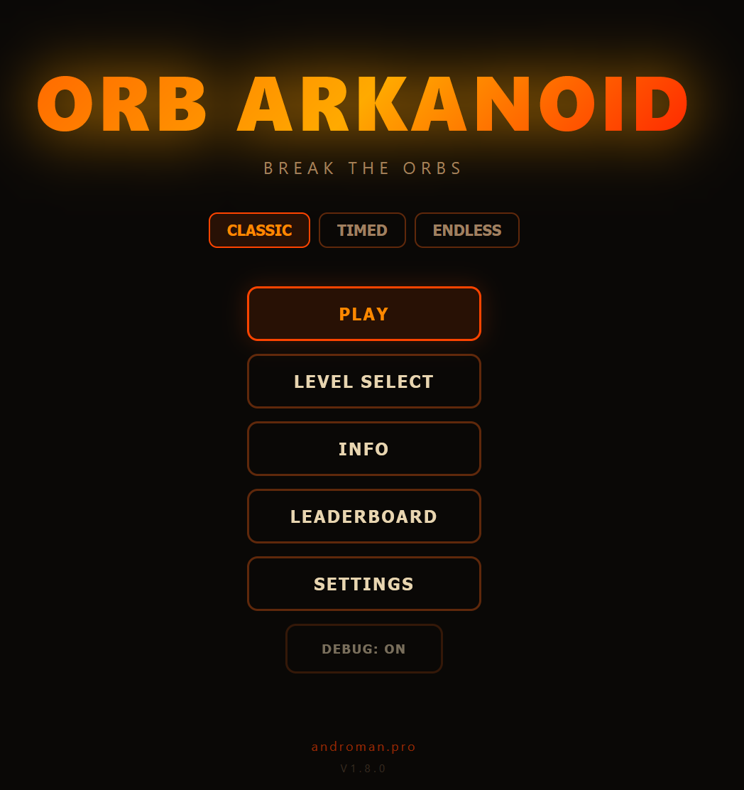

# ORB ARKANOID

**Арканоид с жидкими орбами — WebGL2 + Canvas2D**

Браузерная игра в жанре арканоид, где блоки — это светящиеся шары наполненные жидкостью. При ударе жидкость реагирует волной, при разрушении — сливается вниз и взрывная волна передаётся соседям.



## Геймплей


Орбы трясутся от удара шарика, жидкость плещется внутри, при разрушении выливается вниз — взрывная волна заставляет соседние орбы реагировать. 15 уровней, 9 типов орбов с разной физикой (Fire / Ice / Water / Lava / Steel / Gold / TNT / Rainbow / ...), 8 power-up'ов.

## Настройки


Выбор хвоста шарика (Fire / Lava / Plasma / Ice), длина и размер, локализация RU/EN, таблица рекордов, режим автопроигрыша.

---

## Как запустить

```bash
npx serve -p 5173 .
# → http://localhost:5173
```

Или просто открыть `index.html` в браузере (Chrome/Firefox, нужен WebGL2).

---

## Управление

| Действие | Клавиша / Жест |
|----------|----------------|
| Запуск шарика | SPACE / тап |
| Платформа | мышь / тач |
| Пауза | ESC |
| Debug mode | F1 |
| Следующий уровень (debug) | `]` |
| Предыдущий уровень (debug) | `[` |

## На мобилках

Проверено — играется нормально, платформа следует за пальцем, коллизии и физика работают. **Единственное что не доделано** — нет автоматического fullscreen, браузерные UI-бары остаются сверху. Workaround — «Добавить на главный экран» через меню браузера.

## Режим бота

В настройках есть **бот** — автоматическое прохождение: игра сама прицеливается в конкретные орбы, шарик движется со скоростью ×2.5, уровни проходятся сами. Запустил параллельно с другой задачей — и на экране весело мелькает разлетающаяся жидкость. Для СДВГ-шников: идеальный визуальный шум в углу экрана пока делаешь что-то другое.

---

## Особенности

### Графика
- **WebGL2 шейдер** для орбов: круглый SDF, 2 слоя жидкости с Catmull-Rom интерполяцией, спекулярный блик, корректный alpha-blending
- **Физика волн**: 6-колоночная пружинная система (Verlet), отклик на удар шарика и взрывную волну соседних орбов
- **Анимация слива**: разрушенный орб «выливается» за 0.48 сек с турбулентными волнами
- **Canvas2D** для HUD, шарика, частиц, платформы

### Геймплей
- 15 уровней с тематической музыкой и фонами
- 9 типов орбов: Fire, Ice, Water, Earth, Lava, Steel, Gold, TNT, Rainbow
- 8 power-up: расширение/сужение, огненный шар, мультишар, прилипание, лазеры, жизнь, замедление
- **Бот**: автоматическое прохождение, прицеливание по конкретным орбам, скорость ×2.5
- Система комбо, таблица рекордов, локализация EN/RU

### Настройки
- Тип хвоста: **FIRE / LAVA / PLASMA / ICE** — меняет цвет шарика и частиц
- Длина хвоста: S / M / L
- Размер шарика: S / M / L
- **Превью шарика** в настройках — живая анимация на весь экран, клик для запуска

### Амбиентные эффекты
- **Огненные орбы** (F/L/T): частицы пламени поднимаются вверх
- **Ледяные орбы** (I): снежинки медленно опускаются вниз

---

## Архитектура

```
index.html          — разметка, CSS, канвасы
game.js (~1200 строк)
  ├── CFG / LEVELS / BLOCK_DEFS / POWERUP_DEFS
  ├── WebGL2: VS_BLOCK / FS_BLOCK / VS_BG / FS_BG шейдеры
  ├── Физика: волны, коллизии circle-circle, движение шарика
  ├── Частицы: пул на 2000 объектов
  ├── Музыка: процедурная генерация (Web Audio API)
  ├── UI: экраны, настройки, i18n, таблица рекордов
  └── Тесты: 97 unit-тестов встроено в game.js
_test_runner.js     — Node.js mock DOM + запуск тестов
```

---

## Скриншоты

<!-- paddle-laser.png: платформа с активным эффектом лазера — два механических ствола с красным свечением -->
<!-- paddle-effects.png: платформа с эффектами (iceball спайки, goldball арка, expand крылья и т.д.) -->
<!-- gameplay-lava.png: геймплей на уровне Lava Forge, орбы с живой жидкостью и трещинами -->
<!-- shatter-sequence.png: разбивание орба — осколки в полёте, жидкость ещё внутри -->

---

## Версии

| Версия | Что добавлено |
|--------|--------------|
| 1.6.0 | Живая жидкость в орбах (x8-x20 amp), анимация осколков перед сливом, 9 визуальных эффектов на платформе, лазерные турели, технологичный дизайн платформы |
| 1.5.0 | Футуристичная платформа, 3 новых powerup (Ice/Gold/Lava ball), Steel ломается (hp:5), трещины на орбах, 6 уникальных анимированных фонов |
| 1.3.0 | Fullscreen превью шарика, HITBOX-тогл, фикс дебаг-хитбоксов |
| 1.2.0 | Превью шарика в настройках, длина хвоста, фикс огня орбов |
| 1.1.0 | 3D-вид орбов (шейдер), пресеты хвоста, амбиентные частицы |
| 1.0.0 | Полная игра: WebGL2, 15 уровней, бот, физика волн, music |

---

## Разработка

Игра создана за один день (04.04.2026) как эксперимент с WebGL2 жидкими орбами.
Все фазы разработки: скелет → поведение блоков → музыка → WebGL2 рендерер → физика волн → визуальный polish.

Полный лог изменений: [CHANGELOG.md](CHANGELOG.md)

Подробные девлоги отдельных версий: [devlog-v1.7.1.md](devlog-v1.7.1.md), [devlog-v1.8.0.md](devlog-v1.8.0.md).

---

## Связанные проекты

Инструменты из той же "лаборатории":

- [**lava-orb**](http://192.168.1.130:3000/androman/lava-orb) — npm-библиотека температурно-реактивного орба для `<input type=range>`
- [**liquid-orb-editor**](http://192.168.1.130:3000/androman/liquid-orb-editor) — интерактивный редактор жидкой физики
- [**fire-particle-editor**](http://192.168.1.130:3000/androman/fire-particle-editor) — редактор огненных частиц (пресеты Fire/Ice/Lava/Plasma хвоста — оттуда)
- [**shared-backgrounds**](http://192.168.1.130:3000/androman/shared-backgrounds) — WebGL2 библиотека фонов для игр/опросников
- [**orb-2048**](http://192.168.1.130:3000/androman/orb-2048) — вторая игра на жидких орбах (головоломка 2048)

---

## Лицензия

[MIT](LICENSE) © 2026 andromanpro
